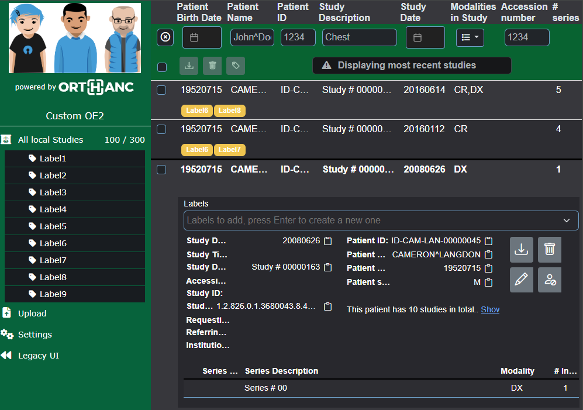

# Purpose

This is a sample setup to demonstrate how to customize the Orthanc-Explorer-2 User Interface by changing the logo and the colors in a custom CSS.

The [custom CSS](./custom.css) is based on [this file](https://github.com/orthanc-server/orthanc-explorer-2/blob/master/WebApplication/src/assets/css/defaults-dark.css)

# Description

This demo contains:

- an Orthanc container that is using a custom CSS and a custom Logo 

# Starting the setup

To start the setup, type: `docker-compose up`

# demo

- Orthanc UI has been customized and is accessible at [http://localhost:8042/ui/app/](http://localhost:8042/ui/app/) and should look like this (I'm sure you can do better !):

